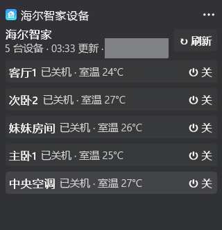

# haier_win11_widgets

把海尔智家（U+ 云）的空调等设备做成 **Windows 11 小组件面板（Win+W）里的原生小组件**：
一张卡片列出账号下全部设备，直接开关机、调温度、切模式 / 风速 / 摆风，状态经网关 WebSocket 实时推送。
不依赖 Home Assistant，不需要额外网关。

A native Windows 11 Widgets Board widget for Haier smart-home (U+ cloud) devices,
written in C# with the Windows App SDK. Lists all devices on one card with power, temperature,
mode, fan and swing controls; state updates arrive over the Haier gateway WebSocket in real time.

云端接口逻辑参考并感谢 [banto6/haier](https://github.com/banto6/haier)（Home Assistant 集成）。

<p align="center"></p>

## 功能

- **总览卡**：每台设备一行，名称 + 状态摘要（模式 / 目标温度 / 风速 / 室温）+ 电源按钮。
- **控制卡**：点某一行切到该设备：温度加减、模式和风速胶囊、开关网格（负离子、新风、自清洁、
  电辅热、加湿、上下 / 左右摆风、睡眠模式……），左上角 `‹` 返回。
- **控件按设备自动生成**：读取设备数字模型，已知属性有中文语义和排序，未知属性按取值范围归类。
- **实时刷新**：登录后保持一条网关 WebSocket 长连接订阅全部设备，状态变化即时推送；
  打开面板时拉一次全部设备（20 秒内重复打开只用缓存），断线自动退避重连。
- **三种尺寸**：小尺寸 3 台设备电源，中尺寸 6 台 + 单设备控制，大尺寸 7 台 + 全部开关。
- **手机号 + 密码登录**，会话自动续期。不支持短信验证码登录（参考实现没有该接口）。
- 另附 `python/`：同一套接口的 Python 封装与命令行工具，方便调试和二次开发。

## 环境要求

| 项目 | 要求 |
| --- | --- |
| 系统 | Windows 11 22H2（22621）及以上，任务栏小组件面板可用 |
| 开发人员模式 | 设置 > 系统 > 开发者选项 > 开发人员模式（未签名的松散包只能这样注册） |
| .NET | [.NET 8 SDK](https://dotnet.microsoft.com/download/dotnet/8.0) |
| 运行库 | [Windows App Runtime 1.8](https://aka.ms/windowsappsdk/1.8/latest/windowsappruntimeinstall-x64.exe) |

不需要 Visual Studio，`dotnet` 命令行即可编译。

## 编译与安装

```powershell
git clone https://github.com/xxxifan/haier_win11_widgets.git
cd haier_win11_widgets
.\install.ps1               # dotnet publish + 复制清单/图标 + Add-AppxPackage -Register
.\install.ps1 -SkipBuild    # 只重新注册
.\install.ps1 -Uninstall    # 卸载
```

脚本会：编译发布到 `publish\`，用 `AppxManifest.xml` 松散注册包 `Xifan.HaierWidget`，
然后重启小组件面板的宿主进程（面板只在启动时枚举小组件提供程序，不重启就看不到新小组件）。
重新安装会取消已固定的卡片，需要重新固定；登录会话保存在包的 `LocalState`，不会丢。

## 使用

1. 开始菜单打开「海尔智家小组件」登录账号（或运行 `start haierwidget://login`）。
2. `Win+W` 打开小组件面板，右上角 `+`，在「海尔智家」下找到「海尔智家设备」固定。
   看不到就再按一次 `Win+W`。
3. 卡片列出全部设备；点某行进入控制卡，点标题或右上角菜单「自定义小组件」进入设置
   （手动刷新、退出登录）。

日志：`%LOCALAPPDATA%\Packages\Xifan.HaierWidget_<hash>\LocalState\widget.log`。

## 调试命令

`HaierWidget.exe` 是无控制台的 WinExe，从 PowerShell 用 `Start-Process -NoNewWindow -Wait -RedirectStandardOutput`
才能看到输出。数据目录默认是包的 `LocalState`，可用环境变量 `HAIER_WIDGET_DATA` 指向任意目录
（里面放 `session.json`），这样不注册包也能联机调试：

```powershell
$exe = ".\HaierWidget\bin\Release\net8.0-windows10.0.22621.0\win-x64\HaierWidget.exe"
$env:HAIER_WIDGET_DATA = "D:\haier-data"
Start-Process $exe "--selftest" -NoNewWindow -Wait -RedirectStandardOutput out.txt; Get-Content out.txt
Start-Process $exe "--dump-card medium" -NoNewWindow -Wait -RedirectStandardOutput card.json       # 总览卡 JSON
Start-Process $exe "--dump-card large 主卧" -NoNewWindow -Wait -RedirectStandardOutput card.json   # 某设备控制卡
Start-Process $exe "--set 主卧 targetTemperature 25" -NoNewWindow -Wait                              # 经网关下发命令
Start-Process $exe "--logout" -NoNewWindow -Wait
```

`--selftest` 离线自检签名、网关消息编解码、会话文件、能力解析和卡片生成。

## 代码结构

```
HaierWidget/                  C# 工程（.NET 8 + Windows App SDK 1.8 Widgets）
  Program.cs                  入口：COM 服务器注册 / 登录协议 / 调试命令
  AppxManifest.xml            包清单：小组件定义、COM 服务器、haierwidget:// 协议
  Haier/                      云端接口移植：HaierApi（签名、设备、数字模型）、HaierSession、HaierGateway（WebSocket）
  Widget/
    WidgetProvider.cs         IWidgetProvider：创建 / 激活 / 动作分发 / 渲染
    HaierHub.cs               进程内数据中枢：会话续期、设备缓存、网关订阅、节流刷新、乐观更新
    CardBuilder.cs            生成 Adaptive Card 1.5（总览卡、控制卡、设置卡、登录卡）
    Capabilities.cs           数字模型 -> 控件列表、状态摘要
  Com/                        COM 类工厂
  Login/                      登录窗口（WinForms）
  Util/                       日志、路径、自检
install.ps1                   编译 + 注册脚本
python/                       Python 接口库（haier/）、命令行 cli.py、离线测试
```

### 实现要点

- 面板通过清单里的 `CreateInstance ClassId` 拉起 `HaierWidget.exe -RegisterProcessAsComServer`，
  进程注册 `IWidgetProvider` 的 COM 类工厂；所有卡片全部取消固定后进程退出。
- 卡片交互全部走 `Action.Execute`，verb 有 `expand / back / set / refresh / login / settings / logout`；
  当前展开的设备存在小组件的 `CustomState`，进程重启后可恢复。
- 小组件面板的卡片渲染器不给带底色的容器加内边距，只认底色、`minHeight` 和列间距，
  所以按钮都是「容器 + 单个居中文本」，窄按钮用不换行空格撑出边距（见 `CardBuilder.Pill`）。
- 云端的数字模型接口一次只接受 1 台设备（多台返回 `B00005`），多台并发逐台请求，并按型号缓存
  属性定义（关机时云端影子会省略温度、模式等属性）。
- 控制经网关 `BatchCmdReq` 下发，先乐观更新卡片，失败回滚。

## Python 接口库与命令行

```powershell
cd python
pip install -r requirements.txt
python cli.py login --phone 138xxxxxxxx
python cli.py whoami
python cli.py devices                      # --json 输出原始数据
python cli.py attrs  客厅空调 --writable    # 可写属性及取值范围
python cli.py status 客厅空调
python cli.py set    客厅空调 onOffStatus=true targetTemperature=26
python cli.py watch                        # 实时监听（Ctrl+C 退出）
python -m unittest discover tests -v       # 离线测试
```

设备参数可以是设备 ID 或名称的一部分。会话默认保存在当前目录 `session.json`
（`--session` 或环境变量 `HAIER_SESSION` 指定），格式与小组件的 `LocalState\session.json` 相同，可互相复制。

```python
import asyncio, aiohttp
from haier import HaierSession, HaierGateway

async def main():
    async with aiohttp.ClientSession() as http:
        session = HaierSession.load("session.json")       # 或 await HaierSession.login(http, phone, password)
        client = await session.ensure_valid(http)
        dev = (await client.get_devices())[0]
        print(await client.get_snapshot(dev.id))
        async with HaierGateway(http, client, on_data=lambda d, v: print(d, v)) as gw:
            await gw.subscribe([dev.id])
            print(await gw.control(dev.id, {"onOffStatus": "true"}))
            await gw.wait_data(dev.id, timeout=5)

asyncio.run(main())
```

## 接口说明

| 用途 | 地址 | 说明 |
| --- | --- | --- |
| 登录 | `POST zj.haier.net/api-gw/oauthserver/account/v1/login` | `{username, password}`，返回 accountToken / refreshToken / expiresIn |
| 刷新 token | `POST zj.haier.net/api-gw/oauthserver/account/v1/refreshToken` | `{refreshToken}`，必须使用签发 token 的 appId |
| 用户信息 | `GET account-api.haier.net/v2/haier/userinfo` | `Authorization: Bearer <token>` |
| 设备列表 | `GET uws.haier.net/uds/v1/protected/deviceinfos` | 返回 `deviceinfos[]` |
| 设备属性 | `POST uws.haier.net/shadow/v1/devdigitalmodels` | `{deviceInfoList:[{deviceId}]}`，一次 1 台 |
| 网关分配 | `POST uws.haier.net/gmsWS/wsag/assign` | `{clientId, token}`，返回 `agAddr` |
| 设备网关 | `wss://<agAddr>/userag?token=&agClientId=` | topic: BoundDevs / HeartBeat / BatchCmdReq / GenMsgDown |

除用户信息接口外，其余 HTTP 接口都需要 header
`accessToken, appId, appKey, clientId, sequenceId, timestamp, sign`，
其中 `sign = sha256(path + 去空白后的body + appId + appKey + timestamp)`。

## 已知限制

- 只在一套海尔中央空调（多台内机）上验证过；其他品类的控件由数字模型自动生成，可能需要在
  `Capabilities.cs` 的已知属性表里补充中文名和排序。
- 未签名松散包只能在开发人员模式下注册；没有提供签名的 MSIX 安装包。
- 小组件面板本身无法截图验证布局，改卡片后请在面板里实际看一眼。

## 致谢与许可

- 云端接口（登录、签名、设备列表、数字模型、网关协议）的实现参考自
  [banto6/haier](https://github.com/banto6/haier)，感谢作者的逆向与整理。
- 本项目以 [Apache-2.0](LICENSE) 许可开源。海尔、海尔智家为海尔集团商标，本项目与海尔无关。
